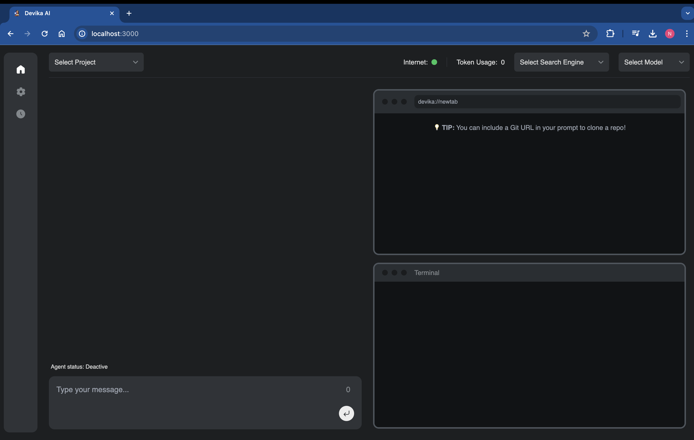
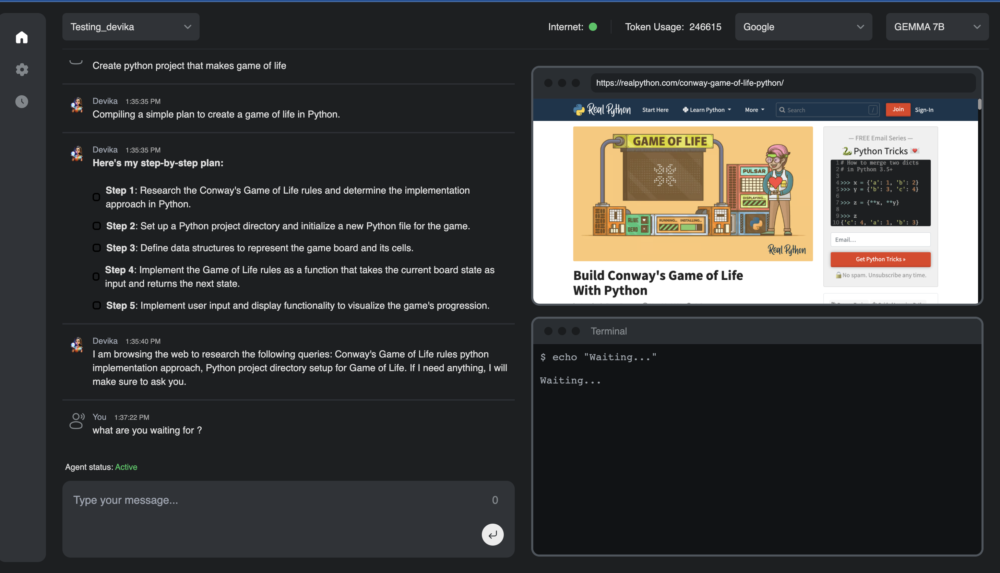

# Devika Project Setup and Development

This files contains all the information for the Devika project setup and development and the steps to follow to setup the project and run the project although the project is still in development phase and there are several bugs in the current implementation,  We should acknoweldge the original project and the developers who are working on this project. As the project is still in beginning phase, I could see the potential of this project and the impact it can create in the future even allowing option to use several language models both closed source and open source. Especially, allowing access to ollama which is completely local and gives flexibility to access open source models for free and also the project  is providing option for multiple search engines

Although, This is not complete working demo. I will try to update regularly and make it work with the help of the original project and the developers who are working on this project and  will try to run local models like llama, Mistral soon using ollama and I am hopeful and excited to see the results and the impact it can create in the future.

## Prerequisites

- Python 3.10
- Anaconda
- Node.js
- npm
- Bun (JavaScript runtime)
- Google Custom Search API Key
- Google Custom Search Engine ID
- (Optional) Language Model API Key (e.g., Groq)

## Setup

1. Create a new Anaconda environment: `conda create -n devika python=3.10` and `conda activate devika`

2. Had some compatibility issues with the packages, so I had to use current active python vesion of repo  and to getthe path of the python version ( which python ) and then use the path to install the packages.
   Install required Python packages: 
   `/Users/Checkout/anaconda3/envs/devika/bin/python pip install -r requirements.txt`

3. Install Node.js and npm (on macOS): `brew install node`

4. Initialize the Playwright project and install dependencies: `npm init playwright@latest # Use TypeScript and accept defaults` and `playwright install --with-deps`

5. change the directory to the project root folder: `cd ui`

6. Install the node packages: `npm install`

7. Install Bun package manager: `curl -fsSL https://bun.sh/install | bash`

8. Run dev server: `bun run dev`

9. If you encounter any issues,  use `source ~/.zshrc` and reactivate the environment using 
   `conda activate devika`

10. Once done open a new terminal and navigate to the project root folder (devika not Devika I know it's confusing) and run the server using `python devika.py` and wait for the message "Devika is up and running".

11. Go back to the previous terminal and you can see and open it  http://localhost:3000/
but this just a frontend and the backend is not running yet and it shows something like this

Then proceed with configuring the project as per the steps below. Don't forget to activate the environment before running any commands (`conda activate devika`). As few times after opening link above it reseted the environment and I had to activate it again.  

## Configuration

Below are the steps to configure the project and they are optional and any combination of search engines and language models can be used.

1. Obtain a Google Custom Search API key from https://developers.google.com/custom-search/v1/introduction and update the `google_search` field in `config.toml`.

2. Create a Custom Search Engine at https://programmablesearchengine.google.com/controlpanel/all and update the `google_search_engine_id` field in `config.toml`.

3. (Optional) Obtain an API key for your preferred language model and update the corresponding field in `config.toml`.

4. (Optional) It even allows to use ollama and run local models like llama, Mistral which is amazing but it is not working correctly due to source code issues and will update the steps once it is working.

## Development

1. Start the server: `cd ../devika  # Navigate to the project root folder` and `python devika.py` - Wait for the message "Devika is up and running".

2. In a new terminal, start the frontend development server: `conda activate devika` and `cd ui` and `bun run dev` - The Devika app should now be accessible at http://localhost:3000.

3. If any terminal becomes unresponsive, open a new terminal, activate the environment, navigate to the respective folder (`devika` or `ui`), and run the appropriate command (`python devika.py` or `bun run dev`).

I could see below screen but too unstable to show the game. But it is a good start and I am hopeful to see the results soon.

## Notes

- Ensure that you have the correct installations and configurations before running the project.
- Replace paths and commands with the appropriate ones for your operating system if not using macOS.
- Refer to the project documentation for more details and troubleshooting steps.
- There are several bugs in the current implementation, and efforts are ongoing to make it run accurately and solve bigger problems.

## References

This is complete replica of Devika project ( https://github.com/stitionai/devika ) and the setup and development steps are referred from the original implementation and youtube ( Matthew berman ).

