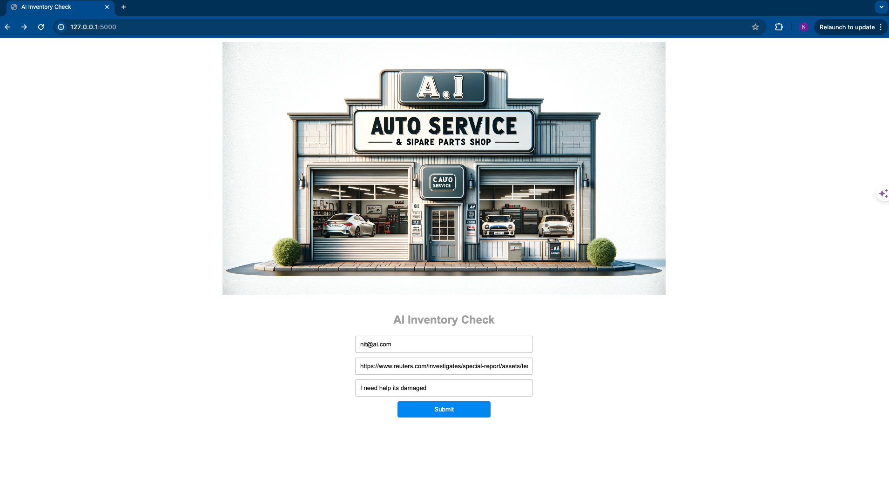
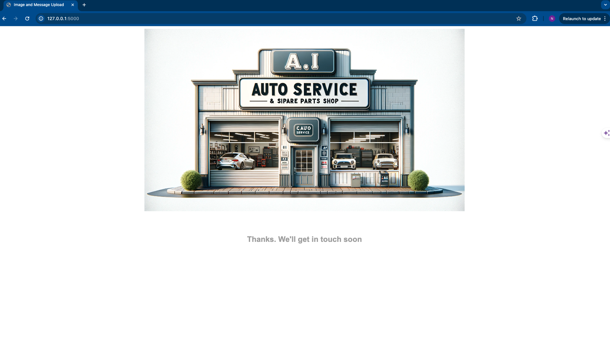
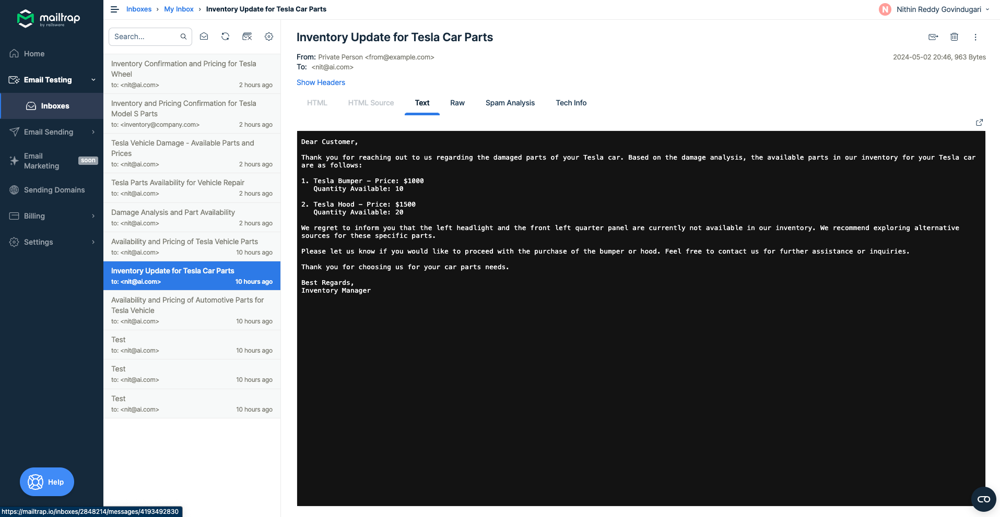

# End-to-End Automotive Damage Analysis using Multi-Agent Frameworks and Generative AI

This project implements an end-to-end automotive damage analysis system using multi-agent frameworks and generative AI techniques. The system automates the process of detecting, classifying, and assessing the severity of vehicle damage, providing an efficient and accurate solution for insurance companies and automotive industry professionals.

## Features

- Utilizes state-of-the-art deep learning models for accurate damage detection and classification
- Implements a multi-agent framework for efficient collaboration and task distribution among specialized agents:
 - User Proxy Agent: Acts as a proxy to the human user and initiates the chat process
 - Damage Analysis Agent: Analyzes the provided image and identifies the car brand and required parts
 - Inventory Manager Agent: Verifies the availability of the required parts in the warehouse database
 - Customer Support Agent: Composes a professional response email to the customer
 - Manager Agent: Manages the group chat and coordinates the workflow among the agents
- Leverages generative AI techniques to enhance damage assessment and report generation
- Provides a user-friendly web interface built with Flask for seamless integration with existing systems
- Offers customizable configurations to adapt to specific industry requirements
- Securely handles customer information and ensures data privacy
- Integrates with an SQLite database to manage the inventory of automotive parts
- Supports email communication with customers using SMTP ( Mailtrap) for sending professional responses

## Getting Started

### Prerequisites

- Python 3.7 or higher
- OpenAI API key
- Mailtrap account for testing email functionality

### Installation

1. Clone the repository: 

```bash
    git clone https://github.com/nithingovindugari/Multi_agent_Frameworks_GenerativeAI.git

```
2. Navigate to the project directory:

```bash
    cd Multi_agent_Frameworks_GenerativeAI/autogen_implementations/end_to_end_automotive_damage_analysis_agents

```
3. Install the required dependencies:
    
    ```bash
        pip install -r requirements.txt
    
    ```
4. Set up the environment variables:
- Create a `.env` file in the project root directory
- Add the following variables to the `.env` file:
  ```
  OPENAI_API_KEY=<your_openai_api_key>
  SMTP_PASSWORD=<your_smtp_password>
  ```
- Replace `<your_openai_api_key>` with your actual OpenAI API key
- Replace `<your_smtp_password>` with your SMTP password (e.g., Mailtrap password)

### Usage

1. Run the Flask application:

```bash
    python app.py
```

2. Open a web browser and navigate to `http://localhost:5000`

3. Fill in the required information in the web form:
- Customer's email address
- Image URL of the damaged vehicle
- Customer's message describing the issue

4. Click the "Submit" button to initiate the automotive damage analysis process

for example:



Image used is https://www.reuters.com/investigates/special-report/assets/tesla-musk-steering-suspension/tesla_auction.jpg?v=360502230224


5. The system will perform the following steps:
- The Damage Analysis Agent will analyze the provided image and identify the car brand and required parts
- The Inventory Manager Agent will verify the availability of the required parts in the warehouse database
- The Customer Support Agent will compose and send a professional response email to the customer



6. After the analysis is complete, the customer will receive an email with the findings and next steps

# sample email sent to the customer



## Project Structure

├── main.py
├── send_mail.py
├── warehouse.py
├── templates/
│   ├── index.html
│   └── result.html
├── static/
│   └── images/
│       └── image.png
├── requirements.txt
└── README.md

- `app.py`: The main script that sets up the multi-agent framework and runs the Flask application. It defines the configuration for the agents, initializes the group chat, and handles the chat initiation process.
- `send_mail.py`: Contains the functionality to send email responses to customers. It uses the SMTP protocol and reads the necessary credentials from environment variables.
- `warehouse.py`: Manages the inventory of automotive parts using an SQLite database. It provides functions to set up the database, add data, and retrieve the warehouse inventory.
- `templates/`: Contains the HTML templates for the web interface. The `index.html` file represents the form for submitting customer information and images, while the `result.html` file displays a success message after the analysis is complete.
- `static/`: Stores static assets such as images used in the web interface.
- `requirements.txt`: Lists the required Python dependencies for the project, including PyAutoGen, Pillow, python-dotenv, and Flask.
- `README.md`: Provides a comprehensive overview of the project, including installation instructions, usage guidelines, and technical details.

## Configuration

The project uses environment variables to store sensitive information such as API keys and passwords. Make sure to set the following variables in the `.env` file:

- `OPENAI_API_KEY`: Your OpenAI API key for accessing the language models used by the agents.
- `SMTP_PASSWORD`: The password for your SMTP server ( Mailtrap) used for sending emails to customers.

## Customization

The project can be customized to fit specific industry requirements or to enhance its functionality. Some possible customization options include:

- Modifying the agent configuration in `main.py` to adjust the system messages, LLM models, or token limits.
- Extending the warehouse database in `warehouse.py` to include additional parts or attributes.
- Customizing the email templates in `send_mail.py` to match your organization's branding and communication style.
- Enhancing the web interface in the `templates/` directory to improve the user experience or add additional features.