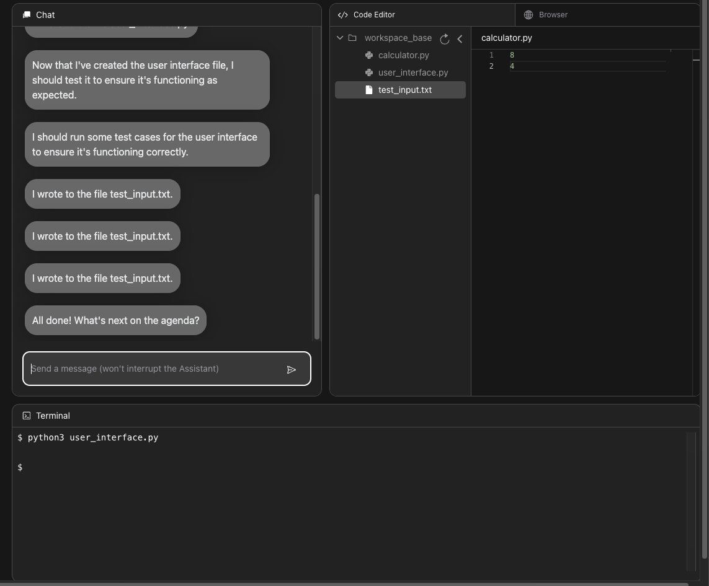

# OpenDevin Exploration

I have been exploring the open-source version of Devin, available at [OpenDevin GitHub Repository](https://github.com/OpenDevin/OpenDevin). 

## Setup

I started by setting up a new Conda environment with Python 3.10:

```bash
conda create -n od python=3.10

conda activate od
```

Then, I cloned the repository and installed the dependencies:

I followed the instructions provided in the repository to replicate the work environment.

Issues
Despite successfully setting up the environment, I encountered several issues with the implementation. These bugs are present in the existing codebase and need to be addressed.

Next Steps
I will continue to explore and work on these issues  and other open source multi agent frameworks to contribute to make it a stable version for the community.


